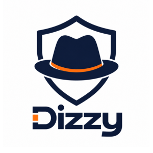

<p align="center">
  <a href="https://dizzysecurity.com" target="_blank">
    
  </a>
</p>

<p align="center">
  <strong>Context-Driven Security Agents | Find, triage, and reproduce security issues with your AI agent</strong>
</p>

<p align="center">
  <a href="https://platform.dizzysecurity.com">Platform</a>
  ·
  <a href="https://dizzysecurity.com">Website</a>
  ·
  <a href="https://github.com/Dizzy-Security/dizzy/releases/latest">Download CLI</a>
  ·
  <a href="AGENTS.md">Agent Reference</a>
</p>

<br />

## What is this?

This repo gives your AI agent (Claude Code, Cursor, Copilot, or any agent that can run a terminal) direct access to the [DizzySecurity](https://dizzysecurity.com) platform.

It includes:

- **`dizzy-scan` CLI** | authenticate, query issues, and reproduce sandbox attack paths
- **`skill.md`** | Claude Code skill — invoke with `/dizzy` for guided triage and reproduction workflows
- **`AGENTS.md`** | full reference for any agent: install, auth, all commands, API paths

---

## Install

**Mac (Apple Silicon)**
```bash
curl -sSL https://github.com/Dizzy-Security/dizzy/releases/latest/download/dizzy-scan-darwin-arm64 \
  -o /usr/local/bin/dizzy-scan && chmod +x /usr/local/bin/dizzy-scan
```

**Linux (amd64)**
```bash
curl -sSL https://github.com/Dizzy-Security/dizzy/releases/latest/download/dizzy-scan-linux-amd64 \
  -o /usr/local/bin/dizzy-scan && chmod +x /usr/local/bin/dizzy-scan
```

**Windows (amd64)**
```powershell
Invoke-WebRequest -Uri "https://github.com/Dizzy-Security/dizzy/releases/latest/download/dizzy-scan-windows-amd64.exe" `
  -OutFile "$env:LOCALAPPDATA\Microsoft\WindowsApps\dizzy-scan.exe"
```

---

## Quickstart

### 1. Log in

```bash
dizzy-scan login
```

Opens your browser to `https://platform.dizzysecurity.com/auth/cli`. After authenticating, your API token is saved automatically. You only need to do this once.

| Platform | Token location |
|----------|---------------|
| Mac / Linux | `~/.dizzy/token` |
| Windows | `%USERPROFILE%\.dizzy\token` |

### 2. Fetch security issues

```bash
dizzy-scan issues                              # all issues
dizzy-scan issues --severity CRITICAL          # filter by severity (CRITICAL | HIGH | MEDIUM | LOW)
dizzy-scan issues --status open --json         # machine-readable JSON
```

### 3. Reproduce a sandbox attack

```bash
# List attack paths for a repo
dizzy-scan sandbox paths https://github.com/your-org/your-repo

# Re-run a specific attack path (triggers the AI attack agent on your live sandbox)
dizzy-scan sandbox rerun https://github.com/your-org/your-repo <path-id>
```

---

## Using with Claude Code

Copy `skill.md` into your project as `.claude/skills/dizzy.md`, then run `/dizzy` inside Claude Code.

The agent will:
1. Check auth — prompt `dizzy-scan login` if no token found
2. Fetch and triage open security issues (severity-sorted table, CRITICAL | HIGH highlighted)
3. Match issues to sandbox attack paths and trigger reruns on demand

---

## Using with any AI agent

Point your agent at `AGENTS.md`. It contains everything needed to operate the CLI autonomously:
- Install commands for each platform
- Auth setup
- All subcommands with flags and example output
- Full API path reference (for direct HTTP calls when the CLI is not available)

---

## API reference

All commands resolve to these backend endpoints. Agents can call them directly with `Authorization: Bearer <token>`.

**Base URL:** `https://api.dizzysecurity.com`

| Method | Path | Description |
|--------|------|-------------|
| GET | `/api/v1/data/issues` | List all issues for the company |
| GET | `/api/v1/sandbox` | List sandboxes |
| GET | `/api/v1/sandbox/{repo_url}/attack-paths` | List attack paths |
| POST | `/api/v1/sandbox/{repo_url}/attack-paths/{path_id}/rerun` | Re-run a specific attack path |
| POST | `/api/v1/sandbox/{repo_url}/attack` | Trigger a full attack |

---

## Files

| File | Purpose |
|------|---------|
| `AGENTS.md` | Full agent reference | install, auth, commands, API paths |
| `skill.md` | Claude Code skill definition (`/dizzy`) |
| `CLAUDE.md` | Claude Code project context (auto-loaded in this directory) |
